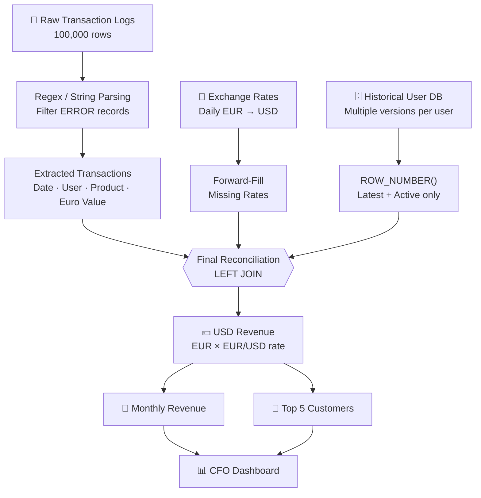
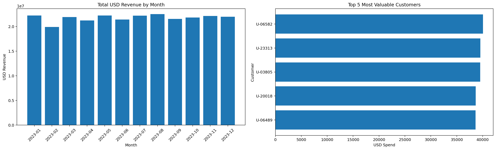

<div align="center">

# 🏦 Enterprise Data Reconciliation & Financial Audit Pipeline

### From Raw Logs to CFO-Ready Insights

*An end-to-end pipeline that turns messy financial transaction logs into a validated, audit-ready dataset and executive-level revenue insights.*

<br>

[](https://www.python.org/)
[](https://pandas.pydata.org/)
[](https://www.sqlite.org/)
[](https://www.sqlite.org/)
[](https://jupyter.org/)
[]()

<br>

**[Overview](#-overview) · [Challenges](#-core-challenges--solutions) · [Architecture](#%EF%B8%8F-architecture) · [Results](#-results) · [Quick Start](#-quick-start) · [Structure](#-project-structure)**

</div>

---

## 📌 Overview

This project simulates a real-world **FinTech audit / corporate-merger scenario**, where critical business data is scattered across inconsistent sources. The pipeline combines:

| Source | Format | Role |
|---|---|---|
| 🧾 `server_logs.txt` | Raw text logs | Transaction events (100,000 lines) |
| 🗄️ `enterprise_database.db` | SQLite | Historical customer versions |
| 💱 `daily_exchange_rates.csv` | CSV | Daily EUR → USD rates (with gaps) |

It is intentionally built around **real-world data engineering problems**, not clean academic datasets.

### 🎯 Business Questions Answered

- ✅ Which transactions are valid?
- ✅ Which customers are *currently* active?
- ✅ What was the correct EUR/USD rate on each transaction date?
- ✅ How much revenue was generated in USD?
- ✅ Which customers generate the most revenue?
- ✅ Can the final dataset be trusted for financial reporting?

---

## 🧩 Core Challenges & Solutions

| # | Challenge | Solution |
|:-:|---|---|
| 1️⃣ | **Scale** – 100K raw records | Vectorized Pandas operations; no `iterrows()` |
| 2️⃣ | **Unstructured logs** – data buried in text, mixed with `ERROR` entries | Regex + `Series.str.extract()`; `ERROR` rows filtered out |
| 3️⃣ | **Missing exchange rates** – gaps would drop valid rows in an `INNER JOIN` | Sort by date → forward-fill → `LEFT JOIN` |
| 4️⃣ | **Customer history** – same `User_ID` appears in multiple versions | SQL `ROW_NUMBER()` window function to pick the latest record |

<details>
<summary><b>🔍 See the key code for each challenge</b></summary>

<br>

**Log parsing (vectorized)**

```python
df["Raw_Server_Log"].str.extract(...)   # instead of df.iterrows()
```

**Exchange-rate gap handling**

```python
rates["EUR_to_USD_Filled"] = rates["EUR_to_USD"].ffill()
```

**Latest customer version**

```sql
WITH ranked_users AS (
    SELECT
        *,
        ROW_NUMBER() OVER (
            PARTITION BY user_id
            ORDER BY datetime(updated_at) DESC, rowid DESC
        ) AS rn
    FROM users
)
SELECT *
FROM ranked_users
WHERE rn = 1
  AND status = 'Active';
```

**USD revenue**

```python
df["USD_Revenue"] = df["Euro_Value"] * df["EUR_to_USD_Filled"]
```

</details>

---

## 🏗️ Architecture



---

## 🔄 Methodology

<details open>
<summary><b>Step 1 — Customer Reconciliation</b></summary>

Load historical records from SQLite, rank each user's versions with `ROW_NUMBER()`, keep `rn = 1` (latest), then filter to `status = 'Active'`. This produces the final active-customer dimension.
</details>

<details open>
<summary><b>Step 2 — Transaction Log Parsing</b></summary>

1. Load raw log lines
2. Filter `ERROR` records
3. Extract the payload
4. Pull out **Date, User ID, Product ID, Euro Value**
5. Convert to proper data types
6. Validate parsed records
7. Produce a parsing audit

**Example valid record**
```text
[2023-03-15 00:00:00] INFO: Transaction processed.
payload={"u":"U-19484","item_code":"PRD-874","eur_val":3404.44}
```

**Example failed record (excluded)**
```text
ERROR: Transaction processed.
payload={"u":"U-21438","item_code":"PRD-793","failed_val":41.24}
```
</details>

<details open>
<summary><b>Step 3 — Exchange-Rate Preparation</b></summary>

`Load → Convert dates → Sort chronologically → Identify gaps → Forward-fill → Validate`
</details>

<details open>
<summary><b>Step 4 — Final Reconciliation</b></summary>

Parsed transactions are `LEFT JOIN`ed with the filled exchange rates and the latest Active customer dimension. An explicit **`Active_User_Match`** flag keeps reconciliation transparent instead of silently dropping unmatched records.
</details>

<details open>
<summary><b>Step 5 & 6 — Revenue & Aggregation</b></summary>

`USD Revenue = Euro Value × EUR/USD Rate`, then aggregated into **monthly revenue** and the **Top 5 customers** (based on transactions matched to the latest Active dimension).
</details>

---

## 📊 Results

The pipeline was executed against the supplied project data:

| KPI | Result |
|---|---:|
| Raw log records | **100,000** |
| `ERROR` records filtered | **5,098** |
| Valid parsed transactions | **94,902** |
| Final reconciled transactions | **94,902** |
| Historical customer records | **47,464** |
| Unique users | **25,000** |
| Latest Active users | **14,183** |
| Transactions matched to latest Active users | **53,899** |
| Exchange-rate source dates | **365** |
| Missing exchange-rate values | **104** |
| Missing rates after `ffill()` | **0** |

> 💡 **Key insight:** All **94,902** valid transactions are preserved, with no rows lost to missing exchange-rate dates. Customer matching is exposed separately through `Active_User_Match` (**53,899** matched).

### 📈 CFO Dashboard

<div align="center">



</div>

- **Total USD Revenue by Month** – revenue trend for financial stakeholders
- **Top 5 Most Valuable Customers** – customer concentration at a glance

---

## ✅ Data Quality & Validation

| Category | Checks |
|---|---|
| **Completeness** | Missing dates, User IDs, Product IDs, Euro values, exchange rates, USD revenue |
| **Uniqueness** | Duplicate customer records, duplicate final rows, unique active-user IDs |
| **Validity** | Numeric values, valid dates, valid user/product IDs, valid exchange rates |
| **Reconciliation** | Raw vs. parsed vs. rejected counts, exchange-rate coverage, customer-match coverage, final row count |

> 🔐 **Data Integrity Principle:** *Never fabricate a financial result.* Every metric comes from the supplied data and actual pipeline execution. Any excluded record must be explainable by error status, parsing failure, validation failure, missing source data, or reconciliation status.

---

## ⚡ Performance Approach

| ❌ Avoided | ✅ Preferred |
|---|---|
| `df.iterrows()` | `Series.str.extract()` |
| Python-level row loops | `Series.str.contains()` |
| | `merge()` · `groupby()` · `transform()` |
| | Vectorized calculations |

A separate 100K-row benchmark fixture (`tests/benchmark_vectorized_regex.py`) tests the Regex approach without mixing synthetic values into the real results.

---

## 🛠️ Tech Stack

| Technology | Purpose |
|---|---|
| **Python** | Main data-processing pipeline |
| **Pandas** | Cleaning, transformation, reconciliation |
| **NumPy** | Efficient numerical operations |
| **Regex** | Unstructured log parsing |
| **SQLite + SQL** | Historical customer DB, version control, reconciliation |
| **Jupyter Notebook** | Interactive analysis |
| **Matplotlib** | CFO dashboard visualization |

---

## 🚀 Quick Start

```bash
# 1. Clone the repository
git clone <your-repository-url>
cd Enterprise_Data_Reconciliation_Project

# 2. Install dependencies
pip install -r requirements.txt

# 3. Confirm input files exist in data/
#    server_logs.txt · enterprise_database.db · daily_exchange_rates.csv

# 4. Run the full pipeline
python src/run_pipeline.py
```

All results are written to the `outputs/` folder.

### 📓 Prefer a notebook?

Open `docs/complete_solution.ipynb`, organized into four phases:

`Phase 1: Advanced SQL` → `Phase 2: Regex / Log Parsing` → `Phase 3: Financial Reconciliation` → `Phase 4: CFO Dashboard`

---

## 📁 Project Structure

```text
Enterprise_Data_Reconciliation_Project/
│
├── data/
│   ├── enterprise_database.db
│   ├── daily_exchange_rates.csv
│   └── server_logs.txt
│
├── src/
│   └── run_pipeline.py
│
├── sql/
│   └── enterprise_reconciliation.sql
│
├── docs/
│   ├── complete_solution.ipynb
│   ├── original_student_work.ipynb
│   ├── project_report.md
│   └── statement.pdf
│
├── tests/
│   └── benchmark_vectorized_regex.py
│
├── outputs/
│   ├── active_users.csv
│   ├── exchange_rates_filled.csv
│   ├── extracted_transactions.csv
│   ├── transaction_parsing_audit.csv
│   ├── final_reconciled_transactions.csv
│   ├── monthly_usd_revenue.csv
│   ├── top5_customers.csv
│   ├── reconciliation_summary.csv
│   ├── data_quality_summary.csv
│   └── cfo_dashboard.png
│
├── requirements.txt
├── README.md
└── PROJECT_STATUS.md
```

### 📤 Generated Outputs

| File | Description |
|---|---|
| `extracted_transactions.csv` | Clean transactions extracted from raw logs |
| `transaction_parsing_audit.csv` | Parsing and rejection statistics |
| `exchange_rates_filled.csv` | Exchange rates after gap handling |
| `active_users.csv` | Latest Active customer dimension |
| `final_reconciled_transactions.csv` | Final transaction-level reconciliation dataset |
| `monthly_usd_revenue.csv` | Monthly USD revenue aggregation |
| `top5_customers.csv` | Top 5 customers by reconciled USD revenue |
| `reconciliation_summary.csv` | Core reconciliation KPIs |
| `data_quality_summary.csv` | Automated quality-control results |
| `cfo_dashboard.png` | CFO-facing dashboard |

---

## 💼 Business Value

✅ Reliable transaction extraction  
✅ Historical customer reconciliation  
✅ Time-series currency handling  
✅ Accurate USD revenue calculation  
✅ Built-in data-quality controls  
✅ Full auditability and traceability  
✅ Scalable processing  
✅ Executive-level visualization  

### 🔍 Why the Solution Is Reliable

The pipeline favors **data preservation + traceability** over silent deletion:

| Problem | Approach |
|---|---|
| Missing exchange rate | Forward-fill → **preserve** the transaction |
| Multiple customer versions | `ROW_NUMBER()` → latest record → Active filter |
| Raw unstructured text | Regex → structured transaction |

---

## 🎓 Skills Demonstrated

`Data Cleaning` · `Data Wrangling` · `Business Analytics` · `Financial Data Analysis` · `SQL` · `Window Functions` · `Python` · `Pandas` · `Regex` · `Time-Series Data` · `Data Reconciliation` · `Data Quality` · `ETL Pipelines` · `Data Validation` · `Financial Reporting` · `Data Visualization` · `Dashboard Development` · `Performance Optimization`

---

## 🔮 Future Improvements

- [ ] Automated scheduled ingestion
- [ ] Incremental transaction processing
- [ ] Cloud data warehouse integration
- [ ] Power BI / Tableau executive dashboard
- [ ] Automated anomaly detection
- [ ] Data lineage tracking
- [ ] SLA monitoring
- [ ] Great Expectations-style data-quality framework
- [ ] CI/CD validation
- [ ] Production logging and observability

---

## 👨‍💻 Author

**Nikhil Kumar**  
BBA | Data Analytics & Business Analytics  
Python • SQL • Excel • Power BI • Tableau • Generative AI

---

<div align="center">

```text
RAW DATA → PROFILING → CLEANING → REGEX EXTRACTION → SQL RECONCILIATION
   → TIME-SERIES HANDLING → CUSTOMER MATCHING → USD REVENUE → VALIDATION → CFO INSIGHTS
```

### 🚀 From Raw Logs to CFO-Ready Insights

⭐ *If you found this project useful, consider giving it a star!* ⭐

</div>
